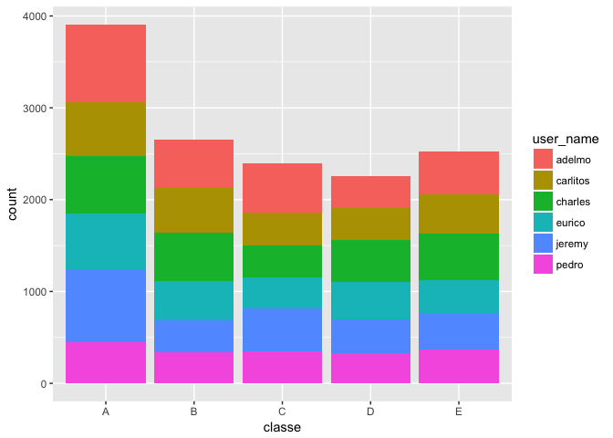
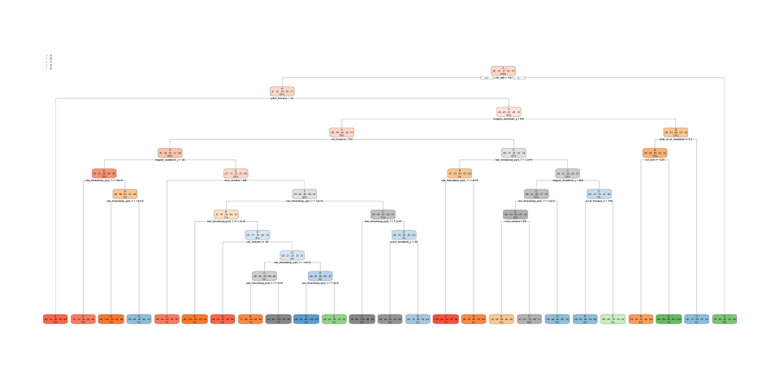
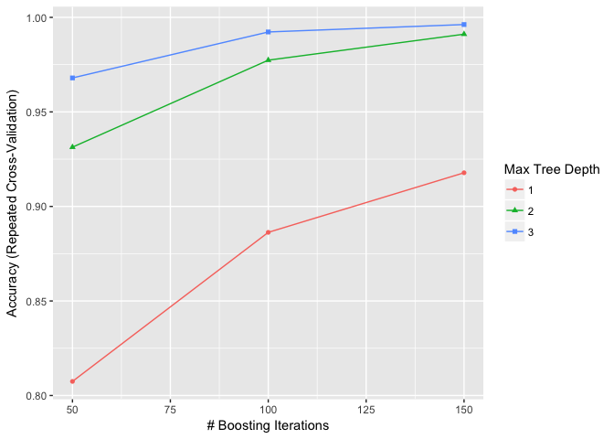

# Week4Project
Hannah Patrick  
10/15/2017  


#Introduction
One thing that people regularly do is quantify how much of a particular activity they do, but they rarely quantify how well they do it. 

In this project, the goal will be to use data from accelerometers on the belt, forearm, arm, and dumbell of 6 participants to predict the manner in which they did the exercise. This is the "classe" variable in the training set. 


#Data

Using devices such as Jawbone Up, Nike FuelBand, and Fitbit it is now possible to collect a large amount of data about personal activity relatively inexpensively. One thing that people regularly do is quantify how much of a particular activity they do, but they rarely quantify how well they do it. 

The data used here is from accelerometers on the belt, forearm, arm, and dumbell of 6 participants. They were asked to perform barbell lifts correctly and incorrectly in 5 different ways. More information is available from the website here: http://web.archive.org/web/20161224072740/http:/groupware.les.inf.puc-rio.br/har (see the section on the Weight Lifting Exercise Dataset).


The training data for this project is available here:

https://d396qusza40orc.cloudfront.net/predmachlearn/pml-training.csv

The test data is available here:

https://d396qusza40orc.cloudfront.net/predmachlearn/pml-testing.csv

The data for this project come from this source: http://web.archive.org/web/20161224072740/http:/groupware.les.inf.puc-rio.br/har. 


#Data Exploration
## Data Preparation/Cleaning

Read in the data:

```r
train <- "http://d396qusza40orc.cloudfront.net/predmachlearn/pml-training.csv"
test <- "http://d396qusza40orc.cloudfront.net/predmachlearn/pml-testing.csv"


traindata <- read.csv(url(train), na.strings=c("NA","#DIV/0!",""))
testdata <- read.csv(url(test), na.strings=c("NA","#DIV/0!",""))
```


The training dataset will be used to train and evaluate the model it is composed of 160 columns and 19622 rows. The test dataset will be used as a final test for this project. 

Some of the datatypes are different between the final test data and the training data. To fix this we will convert all intergers to numeric. 

```r
conv.to.numeric.training <- names(which(sapply(traindata, is.integer)==TRUE))
conv.to.numeric.test <- names(which(sapply(testdata, is.integer)==TRUE))

traindata[,conv.to.numeric.training] <- apply(traindata[,conv.to.numeric.training], 2, function(x) as.numeric(x))
testdata[,conv.to.numeric.test] <- apply(testdata[,conv.to.numeric.test], 2, function(x) as.numeric(x))
```

Splitting the training data further into a training and test data set will allow us to compare the accuracy of models produced and evaluate which method appears to be better suited for predictions on the dataset. The split here was chosen to be 70% train 30% test.


```r
set.seed(1234)
inTrain <- createDataPartition(traindata$classe, p=0.7, list=FALSE)
trainset <- traindata[inTrain, ]
testset <- traindata[-inTrain, ]
```

##Exploration
Distribution of the seen classes:

```r
table(trainset$classe)
```

```
## 
##    A    B    C    D    E 
## 3906 2658 2396 2252 2525
```

Distribution of the class by person: 

```r
ggplot(trainset, aes(x=classe)) + geom_bar(aes(fill=user_name))
```

<!-- -->

Class A is the most commonly seen class. Adelmo is the user with the most recorded exercises. 

It is not necessary to use all 160 columns in the prediction. These should be reduced to those that seem relevant. 

Removing the first column representing the row number:

```r
trainset <- trainset[,-1]
testset <- testset[,-1]
```

Remove near zero variance variables: 

```r
nzv <- nearZeroVar(trainset)
trainset <- trainset[,-nzv]
testset <- testset[,-nzv]
```


Look at the number of NA values for each variable:

```r
sapply(trainset, function(x) sum(is.na(x)))
```

```
##                user_name     raw_timestamp_part_1     raw_timestamp_part_2 
##                        0                        0                        0 
##           cvtd_timestamp               num_window                roll_belt 
##                        0                        0                        0 
##               pitch_belt                 yaw_belt         total_accel_belt 
##                        0                        0                        0 
##       kurtosis_roll_belt      kurtosis_picth_belt       skewness_roll_belt 
##                    13462                    13476                    13461 
##     skewness_roll_belt.1            max_roll_belt           max_picth_belt 
##                    13476                    13453                    13453 
##             max_yaw_belt            min_roll_belt           min_pitch_belt 
##                    13462                    13453                    13453 
##             min_yaw_belt      amplitude_roll_belt     amplitude_pitch_belt 
##                    13462                    13453                    13453 
##     var_total_accel_belt            avg_roll_belt         stddev_roll_belt 
##                    13453                    13453                    13453 
##            var_roll_belt           avg_pitch_belt        stddev_pitch_belt 
##                    13453                    13453                    13453 
##           var_pitch_belt             avg_yaw_belt          stddev_yaw_belt 
##                    13453                    13453                    13453 
##             var_yaw_belt             gyros_belt_x             gyros_belt_y 
##                    13453                        0                        0 
##             gyros_belt_z             accel_belt_x             accel_belt_y 
##                        0                        0                        0 
##             accel_belt_z            magnet_belt_x            magnet_belt_y 
##                        0                        0                        0 
##            magnet_belt_z                 roll_arm                pitch_arm 
##                        0                        0                        0 
##                  yaw_arm          total_accel_arm            var_accel_arm 
##                        0                        0                    13453 
##              gyros_arm_x              gyros_arm_y              gyros_arm_z 
##                        0                        0                        0 
##              accel_arm_x              accel_arm_y              accel_arm_z 
##                        0                        0                        0 
##             magnet_arm_x             magnet_arm_y             magnet_arm_z 
##                        0                        0                        0 
##        kurtosis_roll_arm       kurtosis_picth_arm         kurtosis_yaw_arm 
##                    13504                    13506                    13463 
##        skewness_roll_arm       skewness_pitch_arm         skewness_yaw_arm 
##                    13503                    13506                    13463 
##             max_roll_arm            max_picth_arm              max_yaw_arm 
##                    13453                    13453                    13453 
##             min_roll_arm            min_pitch_arm              min_yaw_arm 
##                    13453                    13453                    13453 
##      amplitude_pitch_arm        amplitude_yaw_arm            roll_dumbbell 
##                    13453                    13453                        0 
##           pitch_dumbbell             yaw_dumbbell   kurtosis_roll_dumbbell 
##                        0                        0                    13457 
##  kurtosis_picth_dumbbell   skewness_roll_dumbbell  skewness_pitch_dumbbell 
##                    13455                    13456                    13454 
##        max_roll_dumbbell       max_picth_dumbbell         max_yaw_dumbbell 
##                    13453                    13453                    13457 
##        min_roll_dumbbell       min_pitch_dumbbell         min_yaw_dumbbell 
##                    13453                    13453                    13457 
##  amplitude_roll_dumbbell amplitude_pitch_dumbbell     total_accel_dumbbell 
##                    13453                    13453                        0 
##       var_accel_dumbbell        avg_roll_dumbbell     stddev_roll_dumbbell 
##                    13453                    13453                    13453 
##        var_roll_dumbbell       avg_pitch_dumbbell    stddev_pitch_dumbbell 
##                    13453                    13453                    13453 
##       var_pitch_dumbbell         avg_yaw_dumbbell      stddev_yaw_dumbbell 
##                    13453                    13453                    13453 
##         var_yaw_dumbbell         gyros_dumbbell_x         gyros_dumbbell_y 
##                    13453                        0                        0 
##         gyros_dumbbell_z         accel_dumbbell_x         accel_dumbbell_y 
##                        0                        0                        0 
##         accel_dumbbell_z        magnet_dumbbell_x        magnet_dumbbell_y 
##                        0                        0                        0 
##        magnet_dumbbell_z             roll_forearm            pitch_forearm 
##                        0                        0                        0 
##              yaw_forearm    kurtosis_roll_forearm   kurtosis_picth_forearm 
##                        0                    13513                    13514 
##    skewness_roll_forearm   skewness_pitch_forearm        max_picth_forearm 
##                    13512                    13514                    13453 
##          max_yaw_forearm        min_pitch_forearm          min_yaw_forearm 
##                    13513                    13453                    13513 
##  amplitude_pitch_forearm      total_accel_forearm        var_accel_forearm 
##                    13453                        0                    13453 
##          gyros_forearm_x          gyros_forearm_y          gyros_forearm_z 
##                        0                        0                        0 
##          accel_forearm_x          accel_forearm_y          accel_forearm_z 
##                        0                        0                        0 
##         magnet_forearm_x         magnet_forearm_y         magnet_forearm_z 
##                        0                        0                        0 
##                   classe 
##                        0
```

Remove variables that contain NA values: 

```r
colsToKeep <- sapply(trainset, function(x) sum(is.na(x)))

colsToKeep <- which(colsToKeep==0)

trainset <- trainset[, colsToKeep]
testset <- testset[,colsToKeep]

# removing timestamp makes no sense to use as a predictor
trainset$cvtd_timestamp <- NULL
testset$cvtd_timestamp <- NULL
```

This leaves us with 56 predictor variables: 

```r
names(trainset)
```

```
##  [1] "user_name"            "raw_timestamp_part_1" "raw_timestamp_part_2"
##  [4] "num_window"           "roll_belt"            "pitch_belt"          
##  [7] "yaw_belt"             "total_accel_belt"     "gyros_belt_x"        
## [10] "gyros_belt_y"         "gyros_belt_z"         "accel_belt_x"        
## [13] "accel_belt_y"         "accel_belt_z"         "magnet_belt_x"       
## [16] "magnet_belt_y"        "magnet_belt_z"        "roll_arm"            
## [19] "pitch_arm"            "yaw_arm"              "total_accel_arm"     
## [22] "gyros_arm_x"          "gyros_arm_y"          "gyros_arm_z"         
## [25] "accel_arm_x"          "accel_arm_y"          "accel_arm_z"         
## [28] "magnet_arm_x"         "magnet_arm_y"         "magnet_arm_z"        
## [31] "roll_dumbbell"        "pitch_dumbbell"       "yaw_dumbbell"        
## [34] "total_accel_dumbbell" "gyros_dumbbell_x"     "gyros_dumbbell_y"    
## [37] "gyros_dumbbell_z"     "accel_dumbbell_x"     "accel_dumbbell_y"    
## [40] "accel_dumbbell_z"     "magnet_dumbbell_x"    "magnet_dumbbell_y"   
## [43] "magnet_dumbbell_z"    "roll_forearm"         "pitch_forearm"       
## [46] "yaw_forearm"          "total_accel_forearm"  "gyros_forearm_x"     
## [49] "gyros_forearm_y"      "gyros_forearm_z"      "accel_forearm_x"     
## [52] "accel_forearm_y"      "accel_forearm_z"      "magnet_forearm_x"    
## [55] "magnet_forearm_y"     "magnet_forearm_z"     "classe"
```


#Creating Models 
Several models were created and compared using the accuracy on our test data set.

## Decision Trees

Create the decision tree model:

```r
set.seed(1234)
DTfit <- rpart(classe ~ ., data=trainset, method="class")
```


```r
#plot the decision tree
rpart.plot(DTfit)
```

<!-- -->

Use this model to predict the class of our testdata:

```r
DTpred <- predict(DTfit, testset, type = "class")
DTcm <- confusionMatrix(DTpred, testset$classe)
DTcm
```

```
## Confusion Matrix and Statistics
## 
##           Reference
## Prediction    A    B    C    D    E
##          A 1585  115   25   50   62
##          B   58  822   31   14   76
##          C    2   45  871   51   87
##          D   24   87   27  768   71
##          E    5   70   72   81  786
## 
## Overall Statistics
##                                          
##                Accuracy : 0.8211         
##                  95% CI : (0.811, 0.8308)
##     No Information Rate : 0.2845         
##     P-Value [Acc > NIR] : < 2.2e-16      
##                                          
##                   Kappa : 0.773          
##  Mcnemar's Test P-Value : < 2.2e-16      
## 
## Statistics by Class:
## 
##                      Class: A Class: B Class: C Class: D Class: E
## Sensitivity            0.9468   0.7217   0.8489   0.7967   0.7264
## Specificity            0.9402   0.9623   0.9619   0.9575   0.9525
## Pos Pred Value         0.8628   0.8212   0.8248   0.7861   0.7751
## Neg Pred Value         0.9780   0.9351   0.9679   0.9601   0.9392
## Prevalence             0.2845   0.1935   0.1743   0.1638   0.1839
## Detection Rate         0.2693   0.1397   0.1480   0.1305   0.1336
## Detection Prevalence   0.3121   0.1701   0.1794   0.1660   0.1723
## Balanced Accuracy      0.9435   0.8420   0.9054   0.8771   0.8395
```


From the above metrics we can see that the model produced the correct prediction 82% of the time. It was most accurate with Class A and least accurate at predicting Class D.

##Random Forests

Create the random forest model:

```r
set.seed(1234)

RFfit <- randomForest(classe ~ ., data=trainset)
RFpred <- predict(RFfit, testset, type = "class")
RFcm <- confusionMatrix(RFpred, testset$classe)
RFcm
```

```
## Confusion Matrix and Statistics
## 
##           Reference
## Prediction    A    B    C    D    E
##          A 1674    2    0    0    0
##          B    0 1137    2    0    0
##          C    0    0 1022    2    0
##          D    0    0    2  962    0
##          E    0    0    0    0 1082
## 
## Overall Statistics
##                                           
##                Accuracy : 0.9986          
##                  95% CI : (0.9973, 0.9994)
##     No Information Rate : 0.2845          
##     P-Value [Acc > NIR] : < 2.2e-16       
##                                           
##                   Kappa : 0.9983          
##  Mcnemar's Test P-Value : NA              
## 
## Statistics by Class:
## 
##                      Class: A Class: B Class: C Class: D Class: E
## Sensitivity            1.0000   0.9982   0.9961   0.9979   1.0000
## Specificity            0.9995   0.9996   0.9996   0.9996   1.0000
## Pos Pred Value         0.9988   0.9982   0.9980   0.9979   1.0000
## Neg Pred Value         1.0000   0.9996   0.9992   0.9996   1.0000
## Prevalence             0.2845   0.1935   0.1743   0.1638   0.1839
## Detection Rate         0.2845   0.1932   0.1737   0.1635   0.1839
## Detection Prevalence   0.2848   0.1935   0.1740   0.1638   0.1839
## Balanced Accuracy      0.9998   0.9989   0.9978   0.9988   1.0000
```

From the above metrics we can see that the model produced near perfect predictions for all classes. With an overall accuracy of 0.9986 this is considerably better than the decision tree model. 


##Boosted Trees

The final model to be tested here is a gradient boosted machine using cross validation. 
This takes longer to run than the other models:

```r
set.seed(1234)
fitControl <- trainControl(method = "repeatedcv",
                           number = 5,
                           repeats = 1)

GBMfit <- train(classe ~ ., data=trainset, method = "gbm",
                 trControl = fitControl,
                 verbose = FALSE)
```

```
## Loading required package: gbm
```

```
## Loading required package: survival
```

```
## 
## Attaching package: 'survival'
```

```
## The following object is masked from 'package:caret':
## 
##     cluster
```

```
## Loading required package: splines
```

```
## Loading required package: parallel
```

```
## Loaded gbm 2.1.3
```

```
## Loading required package: plyr
```

```r
GBMpred <- predict(GBMfit, testset)
GBMcm <- confusionMatrix(GBMpred, testset$classe)
GBMcm
```

```
## Confusion Matrix and Statistics
## 
##           Reference
## Prediction    A    B    C    D    E
##          A 1674    1    0    0    0
##          B    0 1138    1    0    0
##          C    0    0 1019    4    0
##          D    0    0    6  956    6
##          E    0    0    0    4 1076
## 
## Overall Statistics
##                                           
##                Accuracy : 0.9963          
##                  95% CI : (0.9943, 0.9977)
##     No Information Rate : 0.2845          
##     P-Value [Acc > NIR] : < 2.2e-16       
##                                           
##                   Kappa : 0.9953          
##  Mcnemar's Test P-Value : NA              
## 
## Statistics by Class:
## 
##                      Class: A Class: B Class: C Class: D Class: E
## Sensitivity            1.0000   0.9991   0.9932   0.9917   0.9945
## Specificity            0.9998   0.9998   0.9992   0.9976   0.9992
## Pos Pred Value         0.9994   0.9991   0.9961   0.9876   0.9963
## Neg Pred Value         1.0000   0.9998   0.9986   0.9984   0.9988
## Prevalence             0.2845   0.1935   0.1743   0.1638   0.1839
## Detection Rate         0.2845   0.1934   0.1732   0.1624   0.1828
## Detection Prevalence   0.2846   0.1935   0.1738   0.1645   0.1835
## Balanced Accuracy      0.9999   0.9995   0.9962   0.9946   0.9968
```

From the above metrics we can see that the model produced has an overall accuracy of 0.9963 this is only marginally different to the random forest model. The plot below shows the accuracy produced with varying tree depths and boosting iterations. A slight improvement might be accomplished by increasing the tree depth or the number of boosting iterations, however considering the time it would take to run and the marginal improvement it is not considered viable. 


```r
ggplot(GBMfit)
```

```
## Warning: Ignoring unknown aesthetics: shape
```

<!-- -->


#Conclusion 
Using a random forest model produced the best results in this instance, with an accuracy of 0.9986% on the test dataset. This was considerably better than the decision tree and marginally better than the Gradient boosted method. The expected out of sample error rate is (1-0.9986)*100 = 0.14%. 


#Results on test set
The results for the 20 test examples are as follows:


```r
Finalpred <- predict(RFfit, testdata, type = "class")
Finalpred
```

```
##  1  2  3  4  5  6  7  8  9 10 11 12 13 14 15 16 17 18 19 20 
##  B  A  B  A  A  E  D  B  A  A  B  C  B  A  E  E  A  B  B  B 
## Levels: A B C D E
```
```


